# Univariate plotting with pandas
在这个section中，我们学习基础的pandas的功能，从最简单的单变量可视化或者一元可视化开始。
这些基础的工具包括bars plots和line charts.通过这些，我们能够更好的理解pandas画图库的结构，并集花费一些时间来解释数据的格式。


```python
import pandas as pd
import matplotlib.pyplot as plt
# 如果没有加这一句，需要使用plt.show()显示图片
%matplotlib inline 

```


```python
df_reviews = pd.read_csv('../dataSet/winemag-data_first150k.csv',index_col=0) 

df_reviews.head()
```


<div>
<table border="1" class="dataframe">
  <thead>
    <tr style="text-align: right;">
      <th></th>
      <th>country</th>
      <th>description</th>
      <th>designation</th>
      <th>points</th>
      <th>price</th>
      <th>province</th>
      <th>region_1</th>
      <th>region_2</th>
      <th>variety</th>
      <th>winery</th>
    </tr>
  </thead>
  <tbody>
    <tr>
      <th>0</th>
      <td>US</td>
      <td>This tremendous 100% varietal wine hails from ...</td>
      <td>Martha's Vineyard</td>
      <td>96</td>
      <td>235.0</td>
      <td>California</td>
      <td>Napa Valley</td>
      <td>Napa</td>
      <td>Cabernet Sauvignon</td>
      <td>Heitz</td>
    </tr>
    <tr>
      <th>1</th>
      <td>Spain</td>
      <td>Ripe aromas of fig, blackberry and cassis are ...</td>
      <td>Carodorum Selección Especial Reserva</td>
      <td>96</td>
      <td>110.0</td>
      <td>Northern Spain</td>
      <td>Toro</td>
      <td>NaN</td>
      <td>Tinta de Toro</td>
      <td>Bodega Carmen Rodríguez</td>
    </tr>
    <tr>
      <th>2</th>
      <td>US</td>
      <td>Mac Watson honors the memory of a wine once ma...</td>
      <td>Special Selected Late Harvest</td>
      <td>96</td>
      <td>90.0</td>
      <td>California</td>
      <td>Knights Valley</td>
      <td>Sonoma</td>
      <td>Sauvignon Blanc</td>
      <td>Macauley</td>
    </tr>
    <tr>
      <th>3</th>
      <td>US</td>
      <td>This spent 20 months in 30% new French oak, an...</td>
      <td>Reserve</td>
      <td>96</td>
      <td>65.0</td>
      <td>Oregon</td>
      <td>Willamette Valley</td>
      <td>Willamette Valley</td>
      <td>Pinot Noir</td>
      <td>Ponzi</td>
    </tr>
    <tr>
      <th>4</th>
      <td>France</td>
      <td>This is the top wine from La Bégude, named aft...</td>
      <td>La Brûlade</td>
      <td>95</td>
      <td>66.0</td>
      <td>Provence</td>
      <td>Bandol</td>
      <td>NaN</td>
      <td>Provence red blend</td>
      <td>Domaine de la Bégude</td>
    </tr>
  </tbody>
</table>
</div>


# Bar charts(条形图) and categorical data
Bar charts 是最简单的数据可视化。从本数据出发，我们可视化省份对应的数据。统计每个类别出现的次数，并作图显示。例如，早餐中消费的鸡蛋的数量和吃早餐的人的数量基本相当；在我们的数据中，世界上生产wine的省份与它们生产的wine的标签基本也相当。


```python
# 显示最多的次数的前10个做出bar图
df_reviews['province'].value_counts().head(10).plot.bar()

```


    <matplotlib.axes._subplots.AxesSubplot at 0x7f0a02bcd0f0>


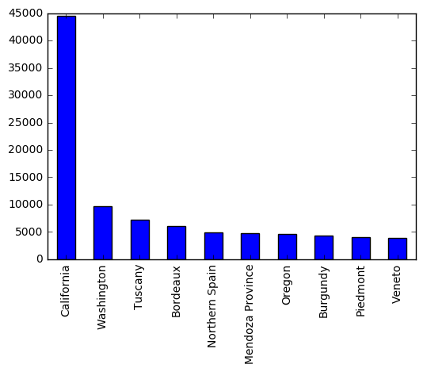


作图是为了更好的理解数据。这个图告诉我们什么呢？它说，California生产的wine比其他城市更多。这还不够鲜明，我们更好的是显示比例的图例。
很简单，每一个个数除以总个数即可：


```python
(df_reviews['province'].value_counts().head(10) / len(df_reviews)).plot.bar()
```


    <matplotlib.axes._subplots.AxesSubplot at 0x7f09fc0d4fd0>


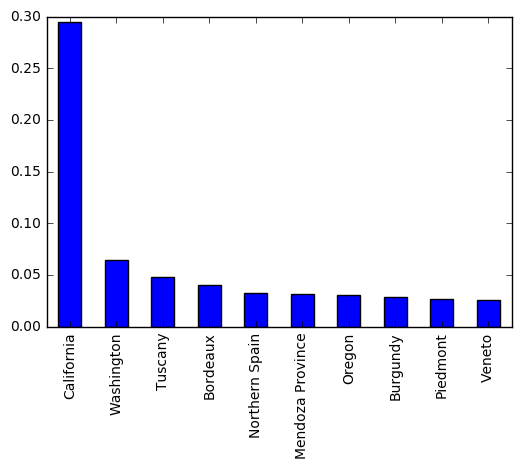


在wine杂志上的wine，California生产的wine占1/3.
Bar charts是灵活的图表：可以表示任何的类别，而且高度可以表示任何的长度(只要是数字)，每一个bar表示任何的类别。
上面的类别表示是原始的纯粹的分类，它的前后顺序是没有意义的，例如国家，邮政编码，象棋类型等都没有先后的顺序；但是有的
类别是有先后顺序的，例如地震的等级大小，公寓包含的房子个数，超市中薯片的袋子的大小。
在我们的数据中，我们可以看一下wine杂志对所有wine的打分：


```python
df_reviews['points'].value_counts().sort_index().plot.bar()
```


    <matplotlib.axes._subplots.AxesSubplot at 0x7f0a01b3e358>


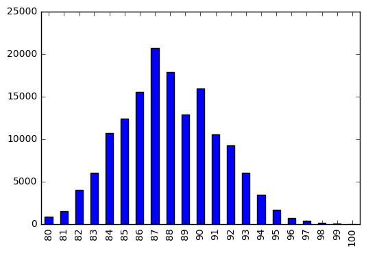


正如你看到的那样，所有的分数集中在80-100之间，而且我们如果相信wine杂志是一个好的评论者，我们可以任务得分92的wine比得分91的wine更好。

# Line Charts(折线图)
在上面的例子中，我们有20中不同的打分，可以用bar charts表示，但是如果我们的分值在0-100之间，就会有100个柱，这对一些出现次数少的是不合适的，于是我们可以使用 line Chart 代替 bar chart。


```python
df_reviews['points'].value_counts().sort_index().plot.line()
```


    <matplotlib.axes._subplots.AxesSubplot at 0x7f0a01b4f048>


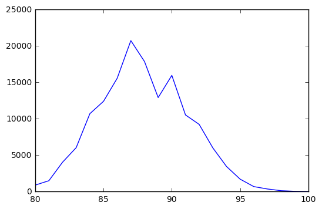


A line chart(折线图)可以传递任何单独的值，它是具有许多单一的值和类别时的首选方案。
折线图的弱点：
+ 不像条形图，它不在能表示随意的类别，在水平坐标上必须是有序的。而且折线图中下降并不代表任何意义(至少在本例子中是)。
+ 折线图更难区分不同值
+ 一般而言，建议使用bat chart(条形图)

# 练习：条形图或折线图

我们做一个快速的练习，假设我们对下面的变量感兴趣, 选择使用更合适的图表表示：
+ Problem：
    1. 有5中不同的口味，同意不同口味的购买的数量。
    2. 从美国所有汽车制造商购买的汽车的平均数。
    3. 0-100之间，在测试中学生的的得分。
    4. 在一个城市中每一个街道的餐馆的数量。
+ Answer:
    1. bar chart
    2. bar chart
    3. line chart
    4. bar chart


# Area Charts
Area chars是由折线图下面的阴影部分的面积组成。
在一个变量的情况下，区域图和折线图基本是相似的，二者可以互换。


```python
df_reviews['points'].value_counts().sort_index().plot.area()

```


    <matplotlib.axes._subplots.AxesSubplot at 0x7f0a01a51518>


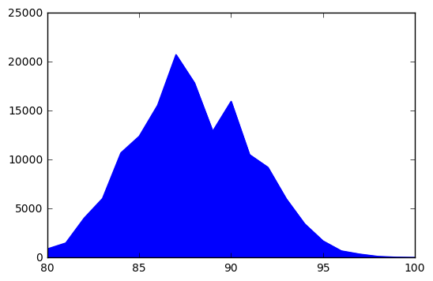


# 区间数据(Interval data)
首先看一个区间变量的例子：飓风中的风速，海水的温度，太阳的温度等等。区间数据在分类数据之上，它是有顺序的，它的值之间的差是有意义的。例如水的温度在之前是-20摄氏度，后来变成了120摄氏度。那么他们之前的差值140是有意义的，表示温度的差值。例如在我们的例子中，points对应的数据，92的分数比89的分数的评测高3分是有意义的。
折线图(line chart)在区间数据上是可以工作的，但是条形图(bar chart)就不可以，我们可以应用新的工具，柱状图(histgram).

使用价格< 200的数据进行作图。


```python
df_reviews[df_reviews['price']<200]['price'].plot.hist()
```


    <matplotlib.axes._subplots.AxesSubplot at 0x7f0a01769ef0>


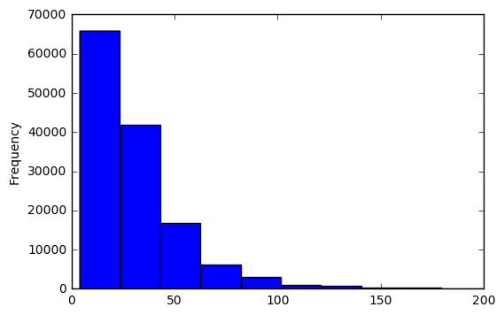


上面的柱状图中，我们可以看到它和条形图很相似。事实上，这就是条形图的一种，只是条形图表示的单一的值，柱状图表示的区间数据。长度都表示个数。
但是柱状图的缺点很明显，因为它要分割数据区间，但是它不能很好的处理峰值。这就是我为什么选择小于200的进行作图。如果我们使用所有的数据进行作图，就会显示出来所有的数据对应的个数，但是图形为了显示后面的数据，就毁坏了前面数据的精度。


```python
df_reviews['price'].plot.hist()
```


    <matplotlib.axes._subplots.AxesSubplot at 0x7f09fde93080>


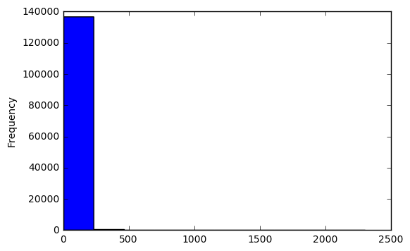


对于上述这种问题，我们需要手动选择数据，之后进行显示，例如我们可以选择出价格price > 1500的之后，再进行显示。就行我们选择小于200的价格显示是一样的道理。我们的原则就是手动选择避免峰值。    
对于类别的变量，柱状图也可以工作的很好。


```python
df_reviews['points'].plot.hist()
```


    <matplotlib.axes._subplots.AxesSubplot at 0x7f09fc6aa630>


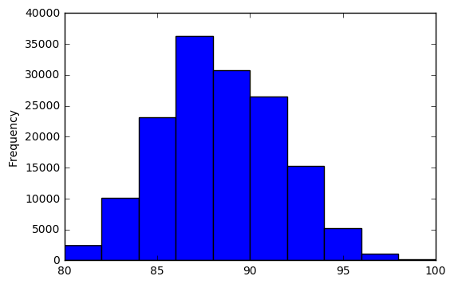


# 练习: bar, line/area, or histgram
对于下面的问题选择更好的显示类型：
+ Problem:
    1. 苹果园中每个类型苹果的采摘的数量?
    2. 一个赛季NBA所有比赛的得分？
    3. 芝加哥每栋楼包含的公寓的个数？
+ Answer:
    1. 我们可以知道这是一个分类的数据，最好使用Bar chart(条形图)
    2. NBA没场比赛的分数在50-180之间，我们可以适用于line chart,或者是用bar chart, 或者histgram
    3. 每一栋楼有的公寓的数目可能在1-1000之间，这是一个区间数据，我们最后使用histgram(柱状图)表示


# 总结和练习
到这里我们已经学习了单变量的四种表示方法，分别是bar chart,line chart, area chart, histgram.    
下面我们使用Pokemon数据做些练习。


```python
df_pokemon = pd.read_csv('../dataSet/pokemon.csv')

# df_pokemon.info()
df_pokemon.head()

```


<div>
<table border="1" class="dataframe">
  <thead>
    <tr style="text-align: right;">
      <th></th>
      <th>abilities</th>
      <th>against_bug</th>
      <th>against_dark</th>
      <th>against_dragon</th>
      <th>against_electric</th>
      <th>against_fairy</th>
      <th>against_fight</th>
      <th>against_fire</th>
      <th>against_flying</th>
      <th>against_ghost</th>
      <th>...</th>
      <th>percentage_male</th>
      <th>pokedex_number</th>
      <th>sp_attack</th>
      <th>sp_defense</th>
      <th>speed</th>
      <th>type1</th>
      <th>type2</th>
      <th>weight_kg</th>
      <th>generation</th>
      <th>is_legendary</th>
    </tr>
  </thead>
  <tbody>
    <tr>
      <th>0</th>
      <td>['Overgrow', 'Chlorophyll']</td>
      <td>1.0</td>
      <td>1.0</td>
      <td>1.0</td>
      <td>0.5</td>
      <td>0.5</td>
      <td>0.5</td>
      <td>2.0</td>
      <td>2.0</td>
      <td>1.0</td>
      <td>...</td>
      <td>88.1</td>
      <td>1</td>
      <td>65</td>
      <td>65</td>
      <td>45</td>
      <td>grass</td>
      <td>poison</td>
      <td>6.9</td>
      <td>1</td>
      <td>0</td>
    </tr>
    <tr>
      <th>1</th>
      <td>['Overgrow', 'Chlorophyll']</td>
      <td>1.0</td>
      <td>1.0</td>
      <td>1.0</td>
      <td>0.5</td>
      <td>0.5</td>
      <td>0.5</td>
      <td>2.0</td>
      <td>2.0</td>
      <td>1.0</td>
      <td>...</td>
      <td>88.1</td>
      <td>2</td>
      <td>80</td>
      <td>80</td>
      <td>60</td>
      <td>grass</td>
      <td>poison</td>
      <td>13.0</td>
      <td>1</td>
      <td>0</td>
    </tr>
    <tr>
      <th>2</th>
      <td>['Overgrow', 'Chlorophyll']</td>
      <td>1.0</td>
      <td>1.0</td>
      <td>1.0</td>
      <td>0.5</td>
      <td>0.5</td>
      <td>0.5</td>
      <td>2.0</td>
      <td>2.0</td>
      <td>1.0</td>
      <td>...</td>
      <td>88.1</td>
      <td>3</td>
      <td>122</td>
      <td>120</td>
      <td>80</td>
      <td>grass</td>
      <td>poison</td>
      <td>100.0</td>
      <td>1</td>
      <td>0</td>
    </tr>
    <tr>
      <th>3</th>
      <td>['Blaze', 'Solar Power']</td>
      <td>0.5</td>
      <td>1.0</td>
      <td>1.0</td>
      <td>1.0</td>
      <td>0.5</td>
      <td>1.0</td>
      <td>0.5</td>
      <td>1.0</td>
      <td>1.0</td>
      <td>...</td>
      <td>88.1</td>
      <td>4</td>
      <td>60</td>
      <td>50</td>
      <td>65</td>
      <td>fire</td>
      <td>NaN</td>
      <td>8.5</td>
      <td>1</td>
      <td>0</td>
    </tr>
    <tr>
      <th>4</th>
      <td>['Blaze', 'Solar Power']</td>
      <td>0.5</td>
      <td>1.0</td>
      <td>1.0</td>
      <td>1.0</td>
      <td>0.5</td>
      <td>1.0</td>
      <td>0.5</td>
      <td>1.0</td>
      <td>1.0</td>
      <td>...</td>
      <td>88.1</td>
      <td>5</td>
      <td>80</td>
      <td>65</td>
      <td>80</td>
      <td>fire</td>
      <td>NaN</td>
      <td>19.0</td>
      <td>1</td>
      <td>0</td>
    </tr>
  </tbody>
</table>
<p>5 rows × 41 columns</p>
</div>


```python

```

+ Problem
    1. pokemon种类type的频率(类别类型，使用bar chart)
    2. pokemon的HP的频率(数字，而且单一值太多，使用 line)
    3. pokemon重量的分布频率(区间数据，使用 histgram)


```python
# 1. pokemon种类type的频率，
df_pokemon['type1'].value_counts().plot.bar()

```


    <matplotlib.axes._subplots.AxesSubplot at 0x7f09fe1d5da0>


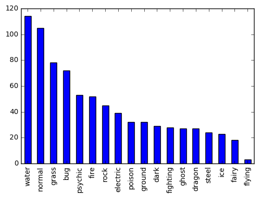


```python
# 2. pokemon的HP的频率
df_pokemon['hp'].value_counts().sort_index().plot.line()
```


    <matplotlib.axes._subplots.AxesSubplot at 0x7f0a016454e0>


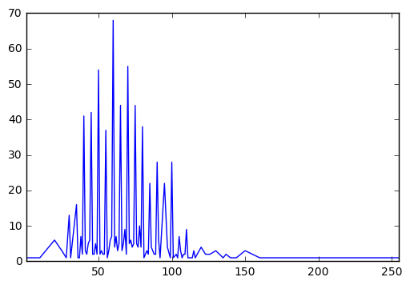


```python
# 3. pokemon重量的分布频率
df_pokemon['weight_kg'].plot.hist()
```


    <matplotlib.axes._subplots.AxesSubplot at 0x7f0a00bf49b0>


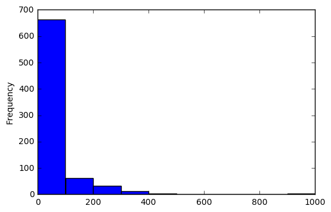


到这里，你可能认为我们的教程应该要结束了，但是我们还有一个图例没有介绍，就是饼状图。    
在功能在饼状图可以完全被bar chart替代。    
我们使用上面的两个数据例子，来看一下这个饼状图的表示。


```python
df_reviews['province'].value_counts().head(10).plot.pie()

# 是图形变成圆形，否则是椭圆形
plt.gca().set_aspect('equal')
```


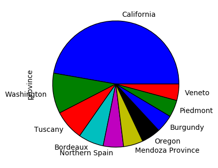


```python
df_pokemon['type2'].value_counts().plot.pie()

plt.gca().set_aspect('equal')
```


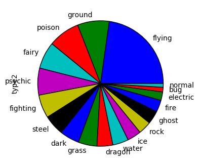


```python

```
