# 基于pandas的双变量的作图
1. Scatter plot --> df.plot.scatter() 
    + 擅长: 区间数据、一些无序的分类数据
2. Hex plot --> df.plot.hex() 
    + 擅长: 区间数据、一些无序的分类数据
3. Stacked Bar Chart --> df.plot.bar(stacked=True) 
    + 擅长: 有序和无序的分类数据
4. Bivarite Line Char --> df.plot.line() 
    + 擅长: 有序的分类数据和区间数据

没有数据关系的数据是空白的无意义的。为了能画出以上的图形，我们需要理解两个变量之间是如何交互的。    
是否同时增减，是否存在线性关系，为了更好的看出这些关系，我们最好从图形上来观察。


```python
import pandas as pd
import matplotlib.pyplot as plt

%matplotlib inline

```


```python
df_reviews = pd.read_csv('../dataSet/winemag-data_first150k.csv',index_col=0)

df_reviews.head(3)
```


<div>
<table border="1" class="dataframe">
  <thead>
    <tr style="text-align: right;">
      <th></th>
      <th>country</th>
      <th>description</th>
      <th>designation</th>
      <th>points</th>
      <th>price</th>
      <th>province</th>
      <th>region_1</th>
      <th>region_2</th>
      <th>variety</th>
      <th>winery</th>
    </tr>
  </thead>
  <tbody>
    <tr>
      <th>0</th>
      <td>US</td>
      <td>This tremendous 100% varietal wine hails from ...</td>
      <td>Martha's Vineyard</td>
      <td>96</td>
      <td>235.0</td>
      <td>California</td>
      <td>Napa Valley</td>
      <td>Napa</td>
      <td>Cabernet Sauvignon</td>
      <td>Heitz</td>
    </tr>
    <tr>
      <th>1</th>
      <td>Spain</td>
      <td>Ripe aromas of fig, blackberry and cassis are ...</td>
      <td>Carodorum Selección Especial Reserva</td>
      <td>96</td>
      <td>110.0</td>
      <td>Northern Spain</td>
      <td>Toro</td>
      <td>NaN</td>
      <td>Tinta de Toro</td>
      <td>Bodega Carmen Rodríguez</td>
    </tr>
    <tr>
      <th>2</th>
      <td>US</td>
      <td>Mac Watson honors the memory of a wine once ma...</td>
      <td>Special Selected Late Harvest</td>
      <td>96</td>
      <td>90.0</td>
      <td>California</td>
      <td>Knights Valley</td>
      <td>Sonoma</td>
      <td>Sauvignon Blanc</td>
      <td>Macauley</td>
    </tr>
  </tbody>
</table>
</div>


# Scatter plot 
散点图是最简单的表示两个变量的图形。散点图能够很好的将两个变量的关系映射到二维空间上。


```python
df_reviews[df_reviews['price'] < 100].sample(100).plot.scatter(x='price', y='points')
```


    <matplotlib.axes._subplots.AxesSubplot at 0x7ff833c17518>


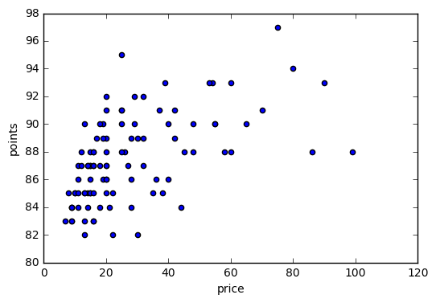


为了能更好的表示出这个图片，我们使用抽样的方式，抽取出100个点进行散点图显示。这是因为散点图不能表示映射到同一个点的多个点，
例如有10个(100,80)的点，在图上只能显示一个点。如果我们不使用抽样，你看到的图中会全是点，基本看不出来模式。如下图显示：


```python
df_reviews[df_reviews['price']<100].plot.scatter(x='price',y='points')

```


    <matplotlib.axes._subplots.AxesSubplot at 0x7ff833969278>


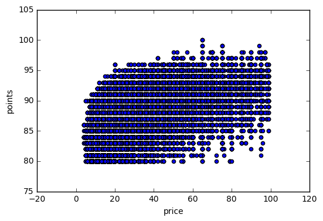


如上图显示的一样，为了解决这个问题，我们已经提出一个抽样的方法，这里使用我们可以使用另一种作图方式，hexplot

# Hexplot
hexplot将所有的点放到六边形内，并且对不同的图形使用不同的颜色程度就行着色。


```python
# gridsize： 表示每个六边形的个数，这里选择有15个
df_reviews[df_reviews['price']<100].plot.hexbin(x='price',y='points', gridsize=15)


```


    <matplotlib.axes._subplots.AxesSubplot at 0x7ff8338a6e10>


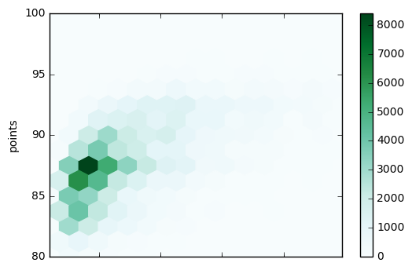


通过前两个图，我们可以看到，散点图可以很好的比较两个变量之间的关系，但是hexplot的图的显示，使得我们不能很好的理解。
从上面的图中，我们能够看到的是，评分87.5的酒大概20美元一瓶。

# Stacked plots
这一章我们新引入了两个图形表示，scatter和hexplot。接着回顾一下上一节提到的几个plot。我们通过使用参数stacking，使其能展示不仅仅一个变量的图形，一个stack图是一个变量在另一个变量头上的显示。下面我们使用另一组数据来演示这个plot。


```python
df_wine_counts = pd.read_csv('../dataSet/top-five-wine-score-counts.csv',index_col=0) # 不包含第一行索引
 
```


```python
df_wine_counts.head()
```


<div>
<table border="1" class="dataframe">
  <thead>
    <tr style="text-align: right;">
      <th></th>
      <th>Bordeaux-style Red Blend</th>
      <th>Cabernet Sauvignon</th>
      <th>Chardonnay</th>
      <th>Pinot Noir</th>
      <th>Red Blend</th>
    </tr>
    <tr>
      <th>points</th>
      <th></th>
      <th></th>
      <th></th>
      <th></th>
      <th></th>
    </tr>
  </thead>
  <tbody>
    <tr>
      <th>80</th>
      <td>5.0</td>
      <td>87.0</td>
      <td>68.0</td>
      <td>36.0</td>
      <td>72.0</td>
    </tr>
    <tr>
      <th>81</th>
      <td>18.0</td>
      <td>159.0</td>
      <td>150.0</td>
      <td>83.0</td>
      <td>107.0</td>
    </tr>
    <tr>
      <th>82</th>
      <td>72.0</td>
      <td>435.0</td>
      <td>517.0</td>
      <td>295.0</td>
      <td>223.0</td>
    </tr>
    <tr>
      <th>83</th>
      <td>95.0</td>
      <td>570.0</td>
      <td>669.0</td>
      <td>346.0</td>
      <td>364.0</td>
    </tr>
    <tr>
      <th>84</th>
      <td>268.0</td>
      <td>923.0</td>
      <td>1146.0</td>
      <td>733.0</td>
      <td>602.0</td>
    </tr>
  </tbody>
</table>
</div>


正如上面的表格所示，是pandas数据的一个普遍现象。列表示一个类别变量，行表示另一个类别变量，他们交叉点表示计数。    
我们首先从bar图的stack开始显示。


```python
df_wine_counts.plot.bar(stacked=True)
```


    <matplotlib.axes._subplots.AxesSubplot at 0x7ff830bdc748>


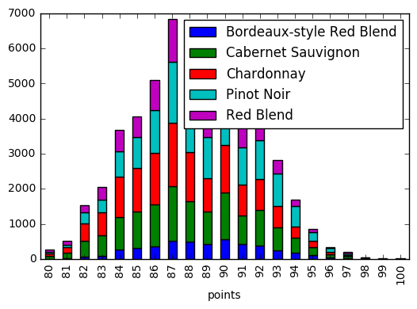


stacked bar图显示单变量bar图的优点和缺点。它可以在无序的和小的有序的类别变量上工作的很好。    
下面是另一个stack例子，area plot.它不会使用参数，就会自动进行处理。


```python
df_wine_counts.plot.area()
```


    <matplotlib.axes._subplots.AxesSubplot at 0x7ff830f7cbe0>


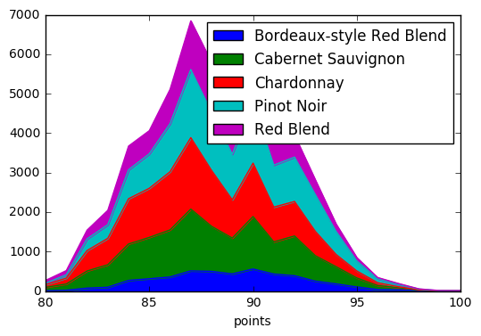


像单变量图一样，多变量的面积图对于无序的类别数据或者区间数据，stacked plot也表现的非常好。但是我们不能忽略两个主要的缺点：    
第一个缺点：    
在这个图中的第二个变量最好有个限定的值大小。八子的形状有时能够很好的解释上界。    
第二个缺点：   
在这个图中，不能很好的解释数据，例如你能告诉我在得分值为87.5的时候，那个颜色出现的次数最多吗？紫色、红色或者绿色？


# Bivariate line chart

我们可以看出line chart的高效性。在line chart中，占用小的空间，显示多天重叠的线，可以很好的比较大小。


```python
df_wine_counts.plot.line()
```


    <matplotlib.axes._subplots.AxesSubplot at 0x7ff833715e48>


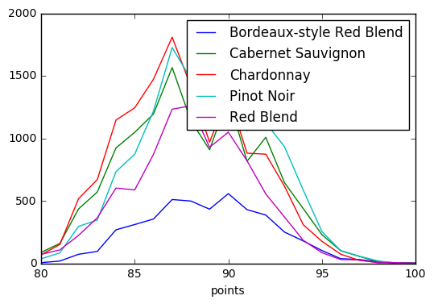


使用line chart，可以解决area chart的问题，我们可以简单的在图中看到，在points=87时，红线(Chardonnay)更加的显眼。

# 练习
使用已经学过的图形，进行答题：
+ Plot Type
    1. Scatter plots
    2. Hex plots
    3. Stacked bar charts and area charts
    4. Bivariate line charts
    
+ Problems:
    1. Scatter plot or hex plot 擅长什么类型的数据？
    2. 什么数据在Stacked bar chart显示更有意义，而不是 bivariate line chart?
    3. 什么数据在bivariate line chart更有意思，而不是Stacked bar chart?
    4. 假设你创建了一个散点图，图中有无数的点堆积在一起，很难解释，你怎么解决这个问题？
    
+ Answers:
    1. Scatter plot 和 hex plot 在无序的类别数据和区间数据的混合中工作的最好。
    2. 无序的类别数据在Stacked bar chart中更有意义，而不是 bivariate line chart。
    3. 区间数据在bivariate line chart中更有意义，而不是Stacked bar chart。
    4. 第一种方法: 对数据抽样显示； 第二种方法：使用hex plot进行显示。

使用Pokemon数据进行练习，实战。


```python
df_pokemon = pd.read_csv('../dataSet/pokemon_simple.csv',index_col=0)
df_pokemon.head(3)
```


<div>
<table border="1" class="dataframe">
  <thead>
    <tr style="text-align: right;">
      <th></th>
      <th>Name</th>
      <th>Type 1</th>
      <th>Type 2</th>
      <th>Total</th>
      <th>HP</th>
      <th>Attack</th>
      <th>Defense</th>
      <th>Sp. Atk</th>
      <th>Sp. Def</th>
      <th>Speed</th>
      <th>Generation</th>
      <th>Legendary</th>
    </tr>
    <tr>
      <th>#</th>
      <th></th>
      <th></th>
      <th></th>
      <th></th>
      <th></th>
      <th></th>
      <th></th>
      <th></th>
      <th></th>
      <th></th>
      <th></th>
      <th></th>
    </tr>
  </thead>
  <tbody>
    <tr>
      <th>1</th>
      <td>Bulbasaur</td>
      <td>Grass</td>
      <td>Poison</td>
      <td>318</td>
      <td>45</td>
      <td>49</td>
      <td>49</td>
      <td>65</td>
      <td>65</td>
      <td>45</td>
      <td>1</td>
      <td>False</td>
    </tr>
    <tr>
      <th>2</th>
      <td>Ivysaur</td>
      <td>Grass</td>
      <td>Poison</td>
      <td>405</td>
      <td>60</td>
      <td>62</td>
      <td>63</td>
      <td>80</td>
      <td>80</td>
      <td>60</td>
      <td>1</td>
      <td>False</td>
    </tr>
    <tr>
      <th>3</th>
      <td>Venusaur</td>
      <td>Grass</td>
      <td>Poison</td>
      <td>525</td>
      <td>80</td>
      <td>82</td>
      <td>83</td>
      <td>100</td>
      <td>100</td>
      <td>80</td>
      <td>1</td>
      <td>False</td>
    </tr>
  </tbody>
</table>
</div>


```python
# 1. 显示 Attack 和 Defense 之间的关系, scaater
df_pokemon.plot.scatter(x='Attack', y='Defense')

```


    <matplotlib.axes._subplots.AxesSubplot at 0x7ff83133e400>


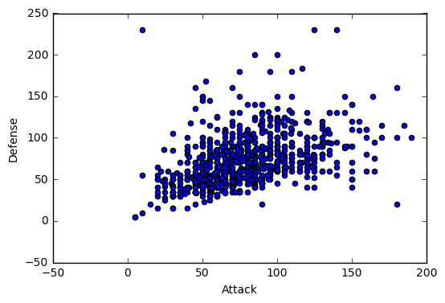


```python
df_pokemon.plot.hexbin(x='Attack',y='Defense',gridsize=20)
```


    <matplotlib.axes._subplots.AxesSubplot at 0x7ff8311967b8>


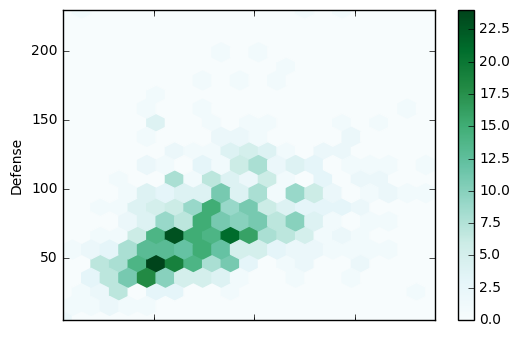


```python
# Stacked bar chart，
# 根据特征(Generation, Legendary)，groupby,求出对应的Attack和Defense的均值进行作图
df_pokemon.groupby(['Generation', 'Legendary']).mean()[['Attack','Defense']].plot.bar(stacked=False)


# 使用Stacked = True
df_pokemon.groupby(['Generation', 'Legendary']).mean()[['Attack','Defense']].plot.bar(stacked=True)

```


    <matplotlib.axes._subplots.AxesSubplot at 0x7ff8312dc240>


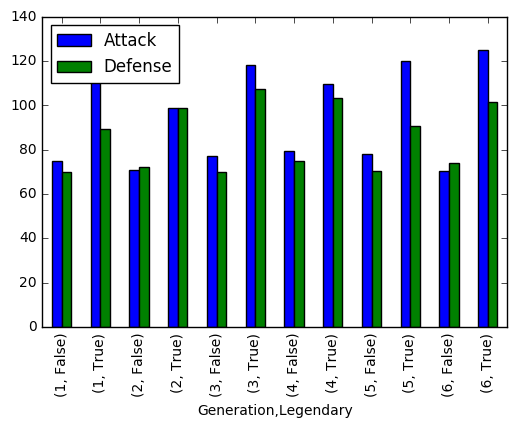


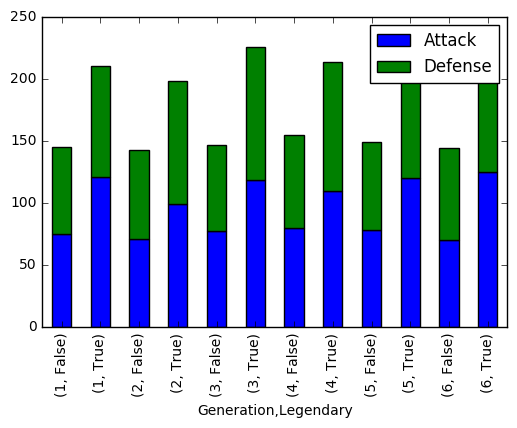


```python
# 根据Generation分组求[HP 	Attack 	Defense 	Sp. Atk 	Sp. Def 	Speed]的平均值，进行显示，
# 这是数字，区间数据，我们使用多种方式显示
pokemen_stats_by_generation = df_pokemon.groupby('Generation').mean()[['HP','Attack','Defense','Sp. Atk','Sp. Def','Speed']]

# line chart
pokemen_stats_by_generation.plot.line()

# bar chart
pokemen_stats_by_generation.plot.bar()

# stackde bar chart
pokemen_stats_by_generation.plot.bar(stacked=True)

# area chart
pokemen_stats_by_generation.plot.area()


# pie chart,使用参数，多个饼图
pokemen_stats_by_generation.plot.pie(subplots=True)


```


    array([<matplotlib.axes._subplots.AxesSubplot object at 0x7ff82aee1d30>,
           <matplotlib.axes._subplots.AxesSubplot object at 0x7ff831387710>,
           <matplotlib.axes._subplots.AxesSubplot object at 0x7ff82b2c59b0>,
           <matplotlib.axes._subplots.AxesSubplot object at 0x7ff830b82c18>,
           <matplotlib.axes._subplots.AxesSubplot object at 0x7ff831478d30>,
           <matplotlib.axes._subplots.AxesSubplot object at 0x7ff82b2da828>], dtype=object)


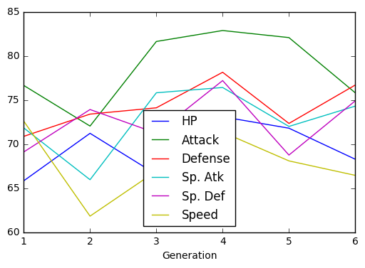


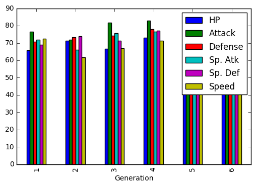


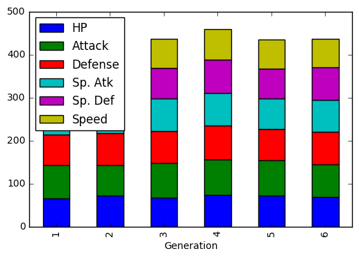


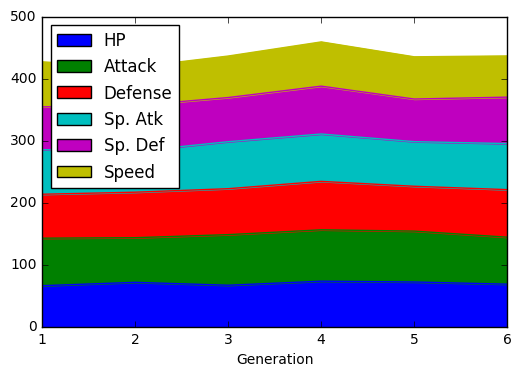


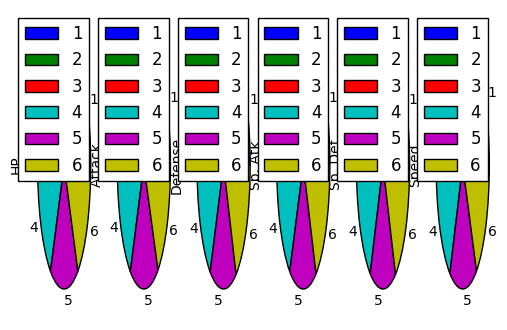


# 总结
+ Plot Type
    1. Scatter plots
    2. Hex plots
    3. Stacked bar charts and area charts
    4. Bivariate line charts

原文地址: https://www.kaggle.com/residentmario/bivariate-plotting-with-pandas/notebook


```python

```
