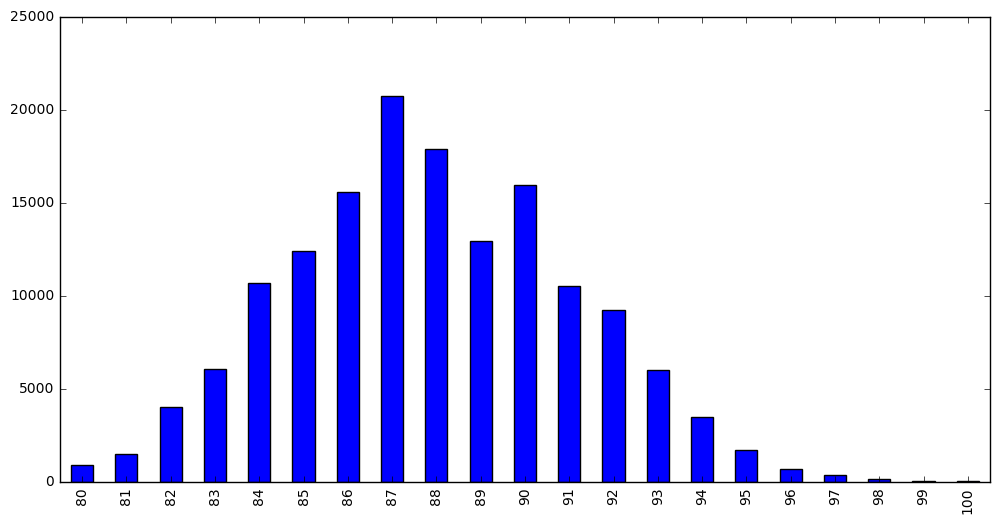
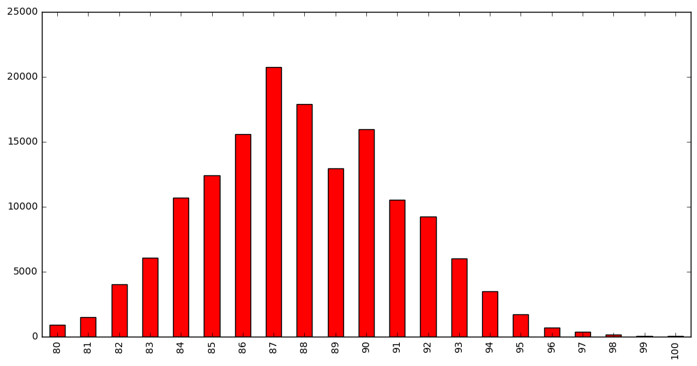
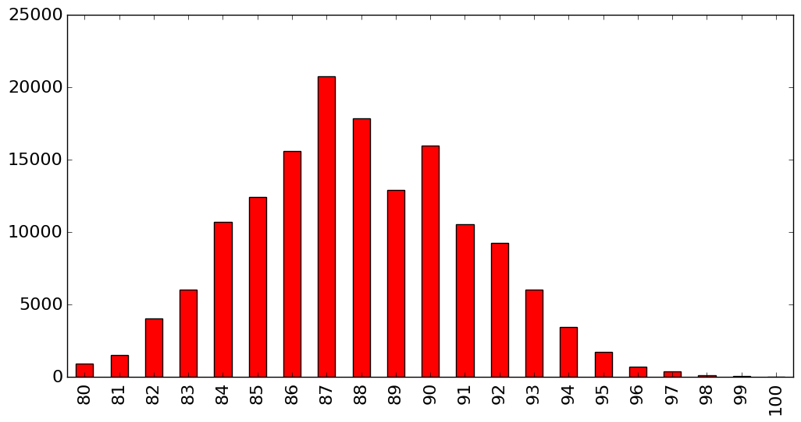
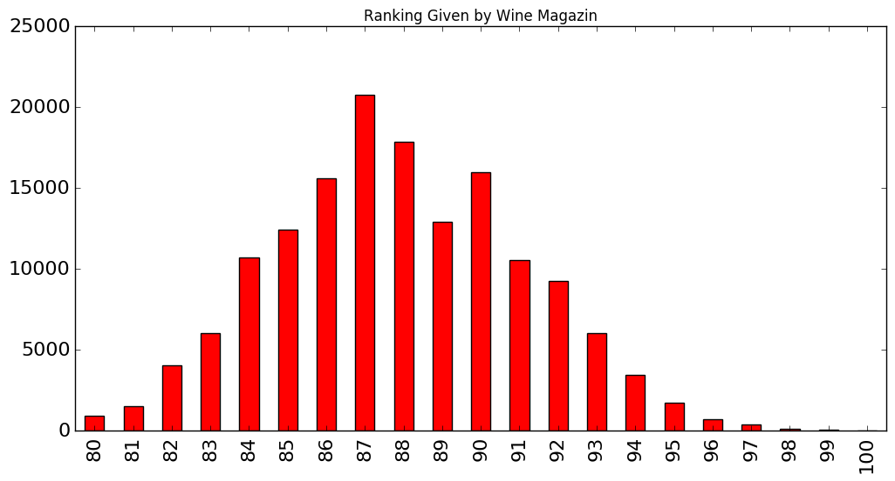
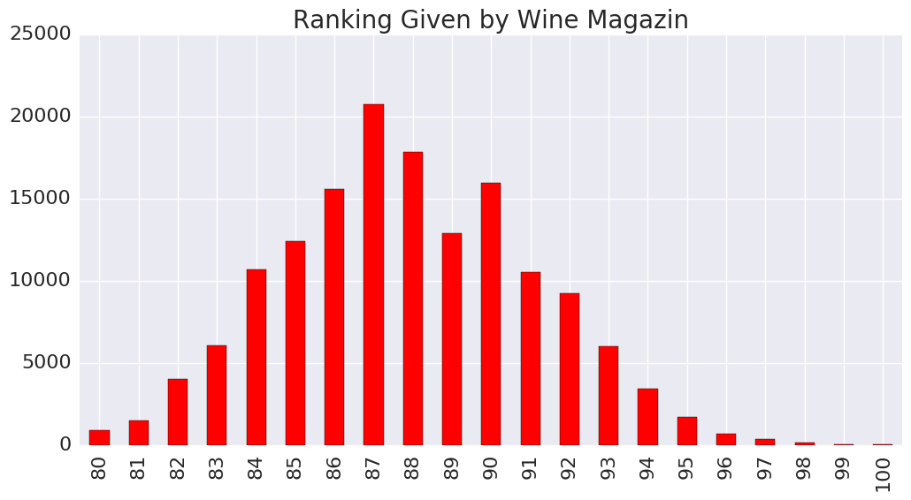
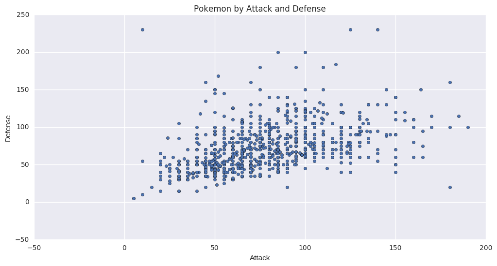
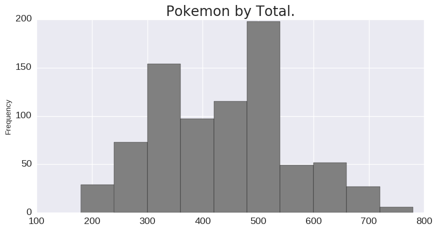
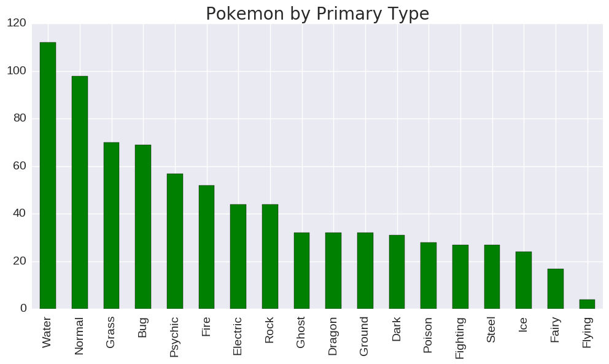

# Styling your plots
## Introduction

我们需要明白一点，在向读者展现图形的时候，图形的格式很重要。修改图形的格式，使新的style更加漂亮，
将很大程度上提高图形的交互性，使工作更加有效。    
这一节中，我们要学习的怎么在已经作出的图中，修改格式。一般而言，你可以在你的plot中做任何事情，修改
任何的格式，我们并不会介绍所有的style，只是介绍最基础的图形格式：改变图形大小，颜色，字体，添加标题，
去掉坐标线。
每一个工具都有自己特有的API函数，来修改不同的style，例如matplotlib和seaborn等都要去查对应的API。


```python
import pandas as pd
import numpy as np
import matplotlib.pyplot as plt

%matplotlib inline

```


```python
df_reviews = pd.read_csv('../dataSet/winemag-data_first150k.csv',index_col=0)

df_reviews.head(3)
```


<div>
<table border="1" class="dataframe">
  <thead>
    <tr style="text-align: right;">
      <th></th>
      <th>country</th>
      <th>description</th>
      <th>designation</th>
      <th>points</th>
      <th>price</th>
      <th>province</th>
      <th>region_1</th>
      <th>region_2</th>
      <th>variety</th>
      <th>winery</th>
    </tr>
  </thead>
  <tbody>
    <tr>
      <th>0</th>
      <td>US</td>
      <td>This tremendous 100% varietal wine hails from ...</td>
      <td>Martha's Vineyard</td>
      <td>96</td>
      <td>235.0</td>
      <td>California</td>
      <td>Napa Valley</td>
      <td>Napa</td>
      <td>Cabernet Sauvignon</td>
      <td>Heitz</td>
    </tr>
    <tr>
      <th>1</th>
      <td>Spain</td>
      <td>Ripe aromas of fig, blackberry and cassis are ...</td>
      <td>Carodorum Selección Especial Reserva</td>
      <td>96</td>
      <td>110.0</td>
      <td>Northern Spain</td>
      <td>Toro</td>
      <td>NaN</td>
      <td>Tinta de Toro</td>
      <td>Bodega Carmen Rodríguez</td>
    </tr>
    <tr>
      <th>2</th>
      <td>US</td>
      <td>Mac Watson honors the memory of a wine once ma...</td>
      <td>Special Selected Late Harvest</td>
      <td>96</td>
      <td>90.0</td>
      <td>California</td>
      <td>Knights Valley</td>
      <td>Sonoma</td>
      <td>Sauvignon Blanc</td>
      <td>Macauley</td>
    </tr>
  </tbody>
</table>
</div>


## Points on style(在特征points上的格式)
继续使用我们前面介绍过的bar plot。


```python
df_reviews['points'].value_counts().sort_index().plot.bar()
```


    <matplotlib.axes._subplots.AxesSubplot at 0x7f15674e0d68>


虽然这个图片，看起来还不错。但是如果你想修改它的大小，更清晰的看清细节，我们可以使用参数figsize来实现。


```python
df_reviews['points'].value_counts().sort_index().plot.bar(figsize=(12,6))
```


    <matplotlib.axes._subplots.AxesSubplot at 0x7f156d7e1f28>





figsize控制图片的大小，它的单位是英寸。使用的参数对应的是(宽，高).接下来，我们将改变颜色，color参数。


```python
df_reviews['points'].value_counts().sort_index().plot.bar(
    figsize=(12,6),
    color='red'
)
```


    <matplotlib.axes._subplots.AxesSubplot at 0x7f156d6e7550>





当图片非常小的时候，坐标轴上的文本，我们很难看清楚，这里的图像很大，并不会有什么影响。其实，可以通过fontsize参数来修改文本的大小。


```python
df_reviews['points'].value_counts().sort_index().plot.bar(
    figsize=(12,6),
    color='red',
    fontsize=16
)
```


    <matplotlib.axes._subplots.AxesSubplot at 0x7f156d516048>





我们还需要一个标题。需要提醒大家的是：matplotlib并不是很好的支持中文的显示。


```python
df_reviews['points'].value_counts().sort_index().plot.bar(
    figsize=(12,6),
    color='red',
    fontsize=16,
    title='Ranking Given by Wine Magazin',
)
```


    <matplotlib.axes._subplots.AxesSubplot at 0x7f156c9f4080>





很不幸，我们的标题有点小，然而pandas的数据可视化，并没有给我们提过修改标题大小的参数。但是我们知道pandas的数据可视化接口都来自matlotlib库，而且matplotlib提供的修改title的大小的方法。因此我们可以先得到matpoltlib对象，再进行添加其他的参数。


```python
ax = df_reviews['points'].value_counts().sort_index().plot.bar(
    figsize=(12,6),
    color='red',
    fontsize=16
)

ax.set_title('Ranking Given by Wine Magazin',fontsize=20)
```


    <matplotlib.text.Text at 0x7f156aa13f98>


在上个cell中，我们首先得到matplotlib的对应，在进行设置其他的参数。下面要介绍另一个包seaborn，它比matplotlib更简单。
它也是基于matplotlib进行封装的。我们可以使用seaborn.despine方法，去掉坐标轴的线。


```python
import seaborn as sns

ax = df_reviews['points'].value_counts().sort_index().plot.bar(
    figsize=(12,6),
    color='red',
    fontsize=16,
)
ax.set_title('Ranking Given by Wine Magazin', fontsize=20)

sns.despine(bottom=True, left=True)
```





Prefect,上面这个图已经很清晰的解释了图表的意义。对图片的style，我们能够做的事情有很多，不仅仅是上面介绍的一些。不同的plot有不同style格式，color是最普遍的，在scatter中s对应的是size。

# 练习
提高设计的技巧。


```python
df_pokemon = pd.read_csv('../dataSet/pokemon_simple.csv')
df_pokemon.head()
```


<div>
<table border="1" class="dataframe">
  <thead>
    <tr style="text-align: right;">
      <th></th>
      <th>#</th>
      <th>Name</th>
      <th>Type 1</th>
      <th>Type 2</th>
      <th>Total</th>
      <th>HP</th>
      <th>Attack</th>
      <th>Defense</th>
      <th>Sp. Atk</th>
      <th>Sp. Def</th>
      <th>Speed</th>
      <th>Generation</th>
      <th>Legendary</th>
    </tr>
  </thead>
  <tbody>
    <tr>
      <th>0</th>
      <td>1</td>
      <td>Bulbasaur</td>
      <td>Grass</td>
      <td>Poison</td>
      <td>318</td>
      <td>45</td>
      <td>49</td>
      <td>49</td>
      <td>65</td>
      <td>65</td>
      <td>45</td>
      <td>1</td>
      <td>False</td>
    </tr>
    <tr>
      <th>1</th>
      <td>2</td>
      <td>Ivysaur</td>
      <td>Grass</td>
      <td>Poison</td>
      <td>405</td>
      <td>60</td>
      <td>62</td>
      <td>63</td>
      <td>80</td>
      <td>80</td>
      <td>60</td>
      <td>1</td>
      <td>False</td>
    </tr>
    <tr>
      <th>2</th>
      <td>3</td>
      <td>Venusaur</td>
      <td>Grass</td>
      <td>Poison</td>
      <td>525</td>
      <td>80</td>
      <td>82</td>
      <td>83</td>
      <td>100</td>
      <td>100</td>
      <td>80</td>
      <td>1</td>
      <td>False</td>
    </tr>
    <tr>
      <th>3</th>
      <td>3</td>
      <td>VenusaurMega Venusaur</td>
      <td>Grass</td>
      <td>Poison</td>
      <td>625</td>
      <td>80</td>
      <td>100</td>
      <td>123</td>
      <td>122</td>
      <td>120</td>
      <td>80</td>
      <td>1</td>
      <td>False</td>
    </tr>
    <tr>
      <th>4</th>
      <td>4</td>
      <td>Charmander</td>
      <td>Fire</td>
      <td>NaN</td>
      <td>309</td>
      <td>39</td>
      <td>52</td>
      <td>43</td>
      <td>60</td>
      <td>50</td>
      <td>65</td>
      <td>1</td>
      <td>False</td>
    </tr>
  </tbody>
</table>
</div>


```python
# 画出 Attacl 和 Defense对应的散点图，并修改大小，添加title
df_pokemon.plot.scatter(x='Attack', y='Defense', figsize=(12,6), title='Pokemon by Attack and Defense')

```


    <matplotlib.axes._subplots.AxesSubplot at 0x7f156a93b6a0>





```python
# 显示Total变量对应的直方图分布
ax = df_pokemon['Total'].plot.hist(
    figsize=(10,5),
    fontsize=14,
    color='gray',
)
ax.set_title('Pokemon by Total.', fontsize=20)
```


    <matplotlib.text.Text at 0x7f155d3c2e80>





```python
# pokemon Type对应的主要类型
ax = df_pokemon['Type 1'].value_counts().plot.bar(
    figsize=(12,6),
    color='green',
    fontsize=14,
)
ax.set_title('Pokemon by Primary Type', fontsize=20)
sns.despine(bottom=True,left=True)
```





# 总结
在这个section中，我们学习了一些小的作图的技巧，使我们的图形更加的吸引人，高效，便于交互。这里主要学习了matplotlib库函数。下一节我们要学习的Subplots。

原文地址: https://www.kaggle.com/residentmario/bivariate-plotting-with-pandas


```python

```
